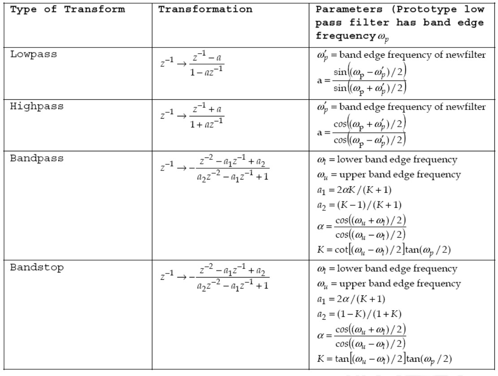

# Overview

[TOC]

## Part I Sampling

### 1-1 Sampling of Analog Signal

Consider a continuous-time signal $x_a(t)$ and a discrete-time signal $x[n]$ is obtained by periodic sampling. 

Let $T$ be the **sampling period**, then we define $x[n]= x_a(nT)$

If $x_a(t) = A\cos(2\pi Ft+\phi)$ and the signal is sampled at a rate of $F_s=\frac{1}{T}$

then $x[n] = A\cos(2\pi FTn+\phi)=A\cos(2\pi nf+\phi)$

#### Normalized Frequency

the signal with an analog frequency of $F$ is sampled at a rate of $F_s$

then the relationship between the **normalized frequency $f$** and the **analog frequency $F$** is

$$
f = \frac{F}{F_s}
$$

### 1-2 Sampling Theorem

- If maximum frequency of the signal is known to be $F_{max}$, the **minimum** sampling rate would be

$$
\text{Nyquist Rate} = 2\times F_{max}
$$
- If the sampling rate is know to be $F_s$, the **maximum** frequency in the **signal** must not exceed

$$
\text{Nyquist Rate} = \frac{1}{2}F_{S}
$$

## Part II Discrete-Time Signals and Systems

### 2-1 Classification of Discrete-Time Signal and System

#### Energy and Power Signals

$$
\begin{aligned}
    E &= \sum_{-\infty}^{\infty}{\|x[n]\|^2}\\[2ex]
    P &= \lim_{N\to\infty}\frac{1}{2N+1}\sum_{x = -N}^{N}{\|x[n]\|^2}
\end{aligned}
$$

#### Periodic Signals

$$
x(n+N) = x(n)
$$

#### Even and Odd Signals

$$
\begin{aligned}
    \text{Even}:\quad x[-n] &= x[n]\\[2ex]
    \text{Odd}:\quad x[-n] &= -x[n]
\end{aligned}
$$

#### Systems

- **FIR**: **finite** impulse response system
- **IIR**: **infinite** impulse response system

> $x[n]\to \delta[n]\qquad y[n]\to h[n]$

### 2-2 Properties of Discrete-Time Signals

#### Linear Property

$$
\begin{aligned}
    x_1[n]\rightarrow y_1[n] &\qquad x_2[n]\rightarrow y_2[n]\\[2ex]
    ax_1[n]+bx_2[n]&\longrightarrow ay_1[n]+by_2[n]
\end{aligned}
$$

#### Displacement Invariant Property

$$
\begin{aligned}
    x[n]&\rightarrow y[n]\\[2ex]
    x[n-n_0]&\rightarrow y[n-n_0]
\end{aligned}
$$

#### Causality

The output of the system at some time instant only depends on the time before.

In other words,

$$
h(n) = 0\qquad n<0
$$

#### Stability

The input is bounded as well as the output is bounded

$$
\begin{aligned}
    \|x[n]\|\leq M_x<\infty\\[2ex]
    \|y[n]\|\leq M_y<\infty
\end{aligned}
$$

### 2-3 Convolution of Discrete-Time Systems

$$
\begin{aligned}
    y[n] &= x[n]*h[n]\\[2ex]
         &= \sum_{k=-\infty}^{\infty}{x[n]h[n-k]}   
\end{aligned}
$$

### 2-4 Correlation Sequences

the **cross correlation** of two energy $x(n)$ and $y(n)$ is defined as 

$$
r_{xy}(l)=\sum_{n=-\infty}^{\infty}{x(n)y(n-l)}
$$

#### Properties

- $r_{yx}(l) = r_{xy}(-l)$
- $r_{xx}(l)=\sum_{n = -\infty}^{\infty}{x(n)x(n-l)}$
- $r_{xx}(l)=r_{xx}(-l)$
- $r_{xy}(l)=x(l)*y(-l)$

#### Normalized Correlation Sequences

the correlation sequences are often normalized to the range $[-1,1]$

$$
\rho_{xy}(l) =\frac{r_{xy}(l)}{\sqrt{r_{xx}(0)r_{yy}(0)}}
$$

#### Correlation of Periodic Sequences

$$
\begin{aligned}
    r_{xy}(l) = \frac{1}{N}\sum_{n=0}^{N-1}{x(n)y(n-l)}\\[2ex]
    r_{xx}(l) = \frac{1}{N}\sum_{n=0}^{N-1}{x(n)x(n-l)}
\end{aligned}
$$

#### Detection of Hidden Periodicity

For a periodic signal $s(n)$, suppose that the signal is buried in noise. Let $\omega(n)$ be the zero-mean white noise. What can we observe is the noisy signal $x(n)$

$$
x(n) = s(n)+\omega(n)
$$

Calculate the autocorrelation sequence of $x(n)$

$$
r_{xx}(l) = r_{ss}(l)+r_{s\omega}+r_{\omega s}+r_{\omega\omega}(l)
$$

Since $\omega(n)$ is a zero-mean white noise signal

$$
r_{s\omega}(l) = 0\qquad r_{\omega s}(l)=0 \qquad r_{s\omega}(l)=0\qquad r_{\omega\omega}(l) = \sigma^2\delta(l)
$$

Then we get

$$
r_{xx}(l) =r_{ss}(l)+\sigma^2\delta(l)
$$

## Part III The z-Transform

### 3-1 The Direct z-Transform

the z-transform of a general discrete-time signal $x[n]$ is defined as

$$
X(z) = \sum_{n=-\infty}^{\infty}{x[n]z^{-n}}
$$

### 3-2 The Inverse z-Transform

$$
X(z) = \sum_{i=1}^{m} \frac{A_i}{1-a_iz^{-1}}
$$

- ROC outside the pole: $\frac{A_i}{1-a_iz^{-1}}\leftrightarrow A_i a_i^nu[n]$
- ROC outside the pole: $\frac{A_i}{1-a_iz^{-1}}\leftrightarrow -A_i a_i^nu[-n-1]$

#### Power-series Expansion

$$
X(z) = \sum_{n=-\infty}^{\infty}{x[n]z^{-n}}
$$

The coefficients in this power series are the sequence values $x[n]$ since $\delta[n+n_0]\leftrightarrow z^{n_0}$

### 3-3 Properties of the z-Transform

#### Linearity

$$
ax_1[n]+bx_2[n] \longleftrightarrow aX_1(z)+bX_2(z)
$$

with the ROC containing $R_1\cap R_2$

#### Time Shifting

$$
x[n-k]\longleftrightarrow z^{-k}X(z)
$$

with ROC = R, except for the possible addition or deletion of the origin or infinity

> For $n_0>0$, poles will be introduced at $z=0$
> For $n_0<0$, zeros will be introduced at $z=0$

#### Scaling in the z-Domain

$$
a^nx[n]\longleftrightarrow X(a^{-1} z)
$$

with ROC = $|a|R$

#### Time Reversal

$$
x[-n]\longleftrightarrow X(z^{-1})
$$

with ROC = $\frac{1}{R}$

#### Differentiation in the z-Domain

$$
nx[n]\longleftrightarrow -z\frac{\mathrm{d}X(z)}{\mathrm{d}z}
$$

with ROC = R

#### Convolution Property

$$
x_1[n]*x_2[n]\longleftrightarrow X_1(z)X_2(z)
$$

#### Initial-Value and Final-Value Theorems

if $x[n]$ is a casual sequence, then

$$
x[0] = \lim_{z\to\infty}{X(z)}
$$

|        Time-Domain        |                              z-Domain                              |      ROC      |
| :-----------------------: | :----------------------------------------------------------------: | :-----------: |
|        $\delta[n]$        |                                $1$                                 |     all z     |
|          $u[n]$           |                        $\frac{1}{1-z^{-1}}$                        |   $\|z\|>1$   |
|         $a^nu[n]$         |                       $\frac{1}{1-az^{-1}}$                        | $\|z\|>\|a\|$ |
|       $-a^nu[-n-1]$       |                       $\frac{1}{1-az^{-1}}$                        | $\|z\|<\|a\|$ |
|        $na^nu[n]$         |                  $\frac{az^{-1}}{(1-az^{-1})^2}$                   | $\|z\|>\|a\|$ |
|      $-na^nu[-n-1]$       |                  $\frac{az^{-1}}{(1-az^{-1})^2}$                   | $\|z\|<\|a\|$ |
|  $\cos(\omega_0 n)u[n]$   |   $\frac{1-z^{-1}\cos(\omega_0)}{1-2z^{-1}\cos\omega_0+z^{-2}}$    |   $\|z\|>1$   |
|  $\sin(\omega_0 n)u[n]$   |    $\frac{z^{-1}\sin(\omega_0)}{1-2z^{-1}\cos\omega_0+z^{-2}}$     |   $\|z\|>1$   |
| $a^n\cos(\omega_0 n)u[n]$ | $\frac{1-az^{-1}\cos(\omega_0)}{1-2az^{-1}\cos\omega_0+a^2z^{-2}}$ |   $\|z\|>1$   |
|  $\sin(\omega_0 n)u[n]$   |  $\frac{az^{-1}\sin(\omega_0)}{1-2az^{-1}\cos\omega_0+a^2z^{-2}}$  |   $\|z\|>1$   |

### 3-4 Analysis of LTI System Using z-Transform

$$
Y(z) = X(z)H(z)
$$

where $H(z)$ is the system function/transfer function

#### Causality

**Definition**: if the ROC of its system function is the exterior of a circle, including infinity

A system with rational system with rational system function $H(z)$ is casual if and only if:

- the ROC is the exterior of a circle outside the outermost pole
- for $H(z)$, the order of numerator cannot be greater than the order of the denominator

#### Stability

**Definition**: the ROC of its system function $H(z)$ includes the unit circle, $|z|=1$

A system with rational system function $H(z)$ is stable if and only if all of the poles of $H(z)$ lie inside the i=unit circle

### 3-5 The Inverse z-Transform Methods

- Inspection Method
  - using the properties and transform paris to get the inverse transform directly

- Power Series Method
  - has only few terms
  - can be found easily using Taylor series expansion/long division

- **Partial Fraction Expansion Method**
  - Simple poles
  - Repeated poles

## Part IV The Discrete Fourier Transform

### 4-1 N-Point DFT

The formula for the DFT is given by

$$
X(k) = \sum_{n=0}^{N-1}x(n)W_N^{nk}\quad W_N = e^{-\frac{2j\pi}{N}}
$$

and also could be expressed as the matrix form

$$
\bold{x}_N=
\begin{bmatrix}
x[0]\\[1ex]
x[1]\\[1ex]
\cdots\\[1ex]
x[N-1]   
\end{bmatrix}\quad \bold{W}_N = 
\begin{bmatrix}
    1&1&1&\cdots&1\\[1ex]
    1&W_N^1&W_N^2&\cdots&W_N^{N-1}\\[1ex]
    1&W_N^2&W_N^4&\cdots&W_N^{2(N-1)}\\[1ex]
    \vdots&\vdots&\vdots&\ddots&\vdots\\[1ex]
    1&W_N^{N-1}&W_N^{2(N-1)}&\cdots&W_N^{(N-1)(N-1)}\\[1ex]
\end{bmatrix}
$$

where the N-point DFT could be expressed in the matrix form as

$$
\bold{X}_N = \bold{W}_N\bold{x}_N
$$

### 4-2 Circular or Linear Convolution Using DFT

For example, do the circular convolution of the following teo sequences

$$
x_1[n] = \{2,1,2,1\}\qquad x_2[n] = \{1,2,3,4\}
$$

Then we can get $x_3$ by

$$
x_3[n] = 
\begin{bmatrix}
1&4&3&2\\[1ex]
2&1&4&3\\[1ex]
3&2&1&4\\[1ex]
4&3&2&1   
\end{bmatrix}
\begin{bmatrix}
    2\\[1ex]
    1\\[1ex]
    2\\[1ex]
    1
\end{bmatrix}=\{14,16,14,16\}
$$

in other way

$$
X_1(k) = 2+W_4^k+2W_4^{2k}+W_4^{3k}\qquad X_2(k) = 1+2W_4^k+3W_4^{2k}+4W_4^{3k}
$$

then according to $Y(k)= X_1(k)X_2(k)$

$$
\begin{aligned}
Y(k) = 2&+5W_4^k+10W_4^{2k}+16W_4^{3k}\\[2ex]
       12W_4^{4k}&+11W_4^{5k}+4W_4^{6k}=14+16W_4^k+14W_4^{2k}+16W_4^{3k}\\[2ex]
\end{aligned}
$$

## Part V The Design of Filter

### 5-1 FIR Filter Design

| Filter Type |                 Impulse Response                  |
| :---------: | :-----------------------------------------------: |
|   Lowpass   |         $\frac{\sin(\omega_c n)}{\pi n}$          |
|  Highpass   |    $\delta(n)-\frac{\sin(\omega_c n)}{\pi n}$     |
|  Bandpass   | $\frac{\sin(\omega_2 n)-\sin(\omega_1 n)}{\pi n}$ |
|  Bandstop   | $\frac{\sin(\omega_1 n)-\sin(\omega_2 n)}{\pi n}$ |

**Given**

- Passband ripple: $A_p = 20\log(1+\delta_p)$
- Passband edge: $f_p=\omega_p/2\pi$
- Stopband attenuation: $A_s = -20\log\delta_s$
- Stopband edge: $f_s=\omega_s/2\pi$
- Sample rate: $f$

#### Window Method Steps

1. Get $\delta_p$ and $\delta_s$ using $A_p$ and $A_s$
2. Calculate $A=-20\log(\min(\delta_s,\delta_p))$
3. Find the appropriate window type which $A_w\geq A$
4. The transition bandwidth $\Delta\omega=2\pi(f_s-f_p)/f\geq \alpha\pi/N$ to get integer N
5. Get cut-off frequency $\omega_c = 2\pi(f_s+f_p)/f$ then the ideal lowpass filter $h_s(n)=\sin(\omega_c n)/(\pi n)$
6. For window function $N_1 = N/2$ or $(N-1)/2$
7. The windowed filter equals the multiply of the window and the filter
8. Delay the impulse response by $N_1$ to obtain the final filter

#### Kaiser Window Steps

1. Get $\delta_p$ and $\delta_s$ using $A_p$ and $A_s$
2. Calculate $A=-20\log(\min(\delta_s,\delta_p))$
3. Determine $\beta$ for the Kaiser window using $A$
4. Compute the filter length $N+1\geq(A-7.95)/(2.285\Delta\omega)$
5. Get cut-off frequency $\omega_c = 2\pi(f_s+f_p)/f$ then the ideal lowpass filter $h_s(n)=\sin(\omega_c n)/(\pi n)$
6. For window function $N_1 = N/2$ or $(N-1)/2$
7. The windowed filter equals the multiply of the window and the filter
8. Delay the impulse response by $N_1$ to obtain the final filter

#### Band Filter Design

1. Get $\delta_p$ and $\delta_s$ using $A_p$ and $A_s$
2. Calculate $A=-20\log(\min(\delta_s,\delta_p))$
3. Find the appropriate window type which $A_w\geq A$
4. Calculate $\Delta f=\min(f_{p_1}'-f_s,f_s'-f_{p_2})$
5. The transition bandwidth $\Delta\omega=2\pi\Delta f/f\geq \alpha\pi/N$ to get integer N
6. Get cut-off frequency $\omega_{c_1}=2\pi(f_{p_1}'-\Delta f/2)/f$ and $\omega_{c_2}=2\pi(f_{p_2}+\Delta f/2)/f$
7. Then the ideal bandpass filter has the impulse response $h_d(n)$
8. For window function $N_1 = N/2$ or $(N-1)/2$
9. The windowed filter equals the multiply of the window and the filter
10. Delay the impulse response by $N_1$ to obtain the final filter

### 5-2 IIR Filter Design

|  $N$  | Normalized Butterworth LPF $H(s)=1/D(s)\quad \Omega_C=1$ |
| :---: | :------------------------------------------------------: |
|  $1$  |                        $D(s)=s+1$                        |
|  $2$  |                  $D(s)=s^2+\sqrt{2}s+1$                  |
|  $3$  |                   $D(s)=s^3+2s^2+2s+1$                   |
|  $4$  |          $D(s)=(s^2+0.7653s+1)(s^2+1.6180s+1)$           |
|  $5$  |         $D(s)=(s+1)(s^2+0.618s+1)(s^2+1.618s+1)$         |

**Given**

- Passband ripple: $A_p = 20\log(1+\delta_p)$
- Passband edge: $f_p=\omega_p/2\pi$
- Stopband attenuation: $A_s = -20\log\delta_s$
- Stopband edge: $f_s=\omega_s/2\pi$
- Sample rate: $f$

#### Butterworth Approximation Steps

1. Specify the filter requirements and get $\Omega_p$ and $\Omega_s$ by equation $\omega/T$
> using $T=1$ for impulse invariant method
2. From $\|H(j\omega)\|^2=(1+(\Omega/\Omega_c)^{2N})^{-1}=(1+\varepsilon^2(\Omega/\Omega_p)^{2N})^{-1}$
3. we get $\|H(j\Omega_p)\|=(1-\delta_p)^2=10^{-\frac{A_p}{10}}$
4. and $\|H(j\Omega_s)\|=\delta_s^2=10^{-\frac{A_s}{10}}$ to solve for $N$ and $\Omega_c$
5. Find the transfer function of the analog filter from the table and get roots by partial fraction expression
6. Find the impulse response $h(t)$ and transfer function $H(z)$

#### Bilinear Transform Steps

1. Get $\omega_{p,s} = 2\pi (f_{p,s}/f)$ then use bilinear transform to get $\Omega_{p,s}=\frac{2}{T}\tan(\omega_{p,s}/2)$
> using $T=1$ for impulse invariant method
2. Using $\|H(j\omega)\|^2=(1+(\Omega/\Omega_c)^{2N})^{-1}=(1+\varepsilon^2(\Omega/\Omega_p)^{2N})^{-1}$
3. We get $\varepsilon^2\leq10^{-\frac{A_p}{10}}-1$ 
4. and $(\Omega_s/\Omega_p)^{2N}\geq \frac{10^{\frac{A_s}{10}}-1}{\varepsilon^2}$ solve for $\varepsilon^2$ and $N$
5. The analog filter is mapped into the desired digital filter $H(z)=H_a(s)|_{s=\frac{2}{T}\frac{1-z^{-1}}{1+z^{-1}}}$, where $H_a(s) = \frac{1}{s+1}$

