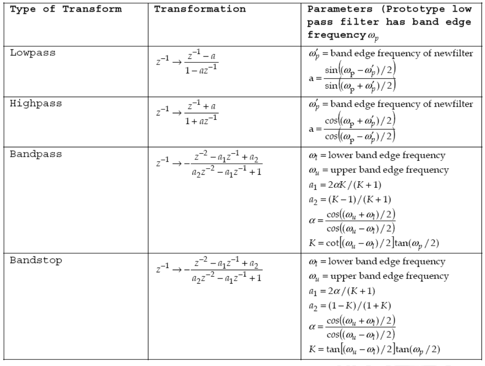

# Part V The Design of Filter

## 5-1 FIR Filter Design

| Filter Type |                 Impulse Response                  |
| :---------: | :-----------------------------------------------: |
|   Lowpass   |         $\frac{\sin(\omega_c n)}{\pi n}$          |
|  Highpass   |    $\delta(n)-\frac{\sin(\omega_c n)}{\pi n}$     |
|  Bandpass   | $\frac{\sin(\omega_2 n)-\sin(\omega_1 n)}{\pi n}$ |
|  Bandstop   | $\frac{\sin(\omega_1 n)-\sin(\omega_2 n)}{\pi n}$ |

**Given**

- Passband ripple: $A_p = 20\log(1+\delta_p)$
- Passband edge: $f_p=\omega_p/2\pi$
- Stopband attenuation: $A_s = -20\log\delta_s$
- Stopband edge: $f_s=\omega_s/2\pi$
- Sample rate: $f$

### Window Method Steps

1. Get $\delta_p$ and $\delta_s$ using $A_p$ and $A_s$
2. Calculate $A=-20\log(\min(\delta_s,\delta_p))$
3. Find the appropriate window type which $A_w\geq A$
4. The transition bandwidth $\Delta\omega=2\pi(f_s-f_p)/f\geq \alpha\pi/N$ to get integer N
5. Get cut-off frequency $\omega_c = 2\pi(f_s+f_p)/f$ then the ideal lowpass filter $h_s(n)=\sin(\omega_c n)/(\pi n)$
6. For window function $N_1 = N/2$ or $(N-1)/2$
7. The windowed filter equals the multiply of the window and the filter
8. Delay the impulse response by $N_1$ to obtain the final filter

### Kaiser Window Steps

1. Get $\delta_p$ and $\delta_s$ using $A_p$ and $A_s$
2. Calculate $A=-20\log(\min(\delta_s,\delta_p))$
3. Determine $\beta$ for the Kaiser window using $A$
4. Compute the filter length $N+1\geq(A-7.95)/(2.285\Delta\omega)$
5. Get cut-off frequency $\omega_c = 2\pi(f_s+f_p)/f$ then the ideal lowpass filter $h_s(n)=\sin(\omega_c n)/(\pi n)$
6. For window function $N_1 = N/2$ or $(N-1)/2$
7. The windowed filter equals the multiply of the window and the filter
8. Delay the impulse response by $N_1$ to obtain the final filter

### Band Filter Design

1. Get $\delta_p$ and $\delta_s$ using $A_p$ and $A_s$
2. Calculate $A=-20\log(\min(\delta_s,\delta_p))$
3. Find the appropriate window type which $A_w\geq A$
4. Calculate $\Delta f=\min(f_{p_1}'-f_s,f_s'-f_{p_2})$
5. The transition bandwidth $\Delta\omega=2\pi\Delta f/f\geq \alpha\pi/N$ to get integer N
6. Get cut-off frequency $\omega_{c_1}=2\pi(f_{p_1}'-\Delta f/2)/f$ and $\omega_{c_2}=2\pi(f_{p_2}+\Delta f/2)/f$
7. Then the ideal bandpass filter has the impulse response $h_d(n)$
8. For window function $N_1 = N/2$ or $(N-1)/2$
9. The windowed filter equals the multiply of the window and the filter
10. Delay the impulse response by $N_1$ to obtain the final filter

## 5-2 IIR Filter Design

|  $N$  | Normalized Butterworth LPF $H(s)=1/D(s)\quad \Omega_C=1$ |
| :---: | :------------------------------------------------------: |
|  $1$  |                        $D(s)=s+1$                        |
|  $2$  |                  $D(s)=s^2+\sqrt{2}s+1$                  |
|  $3$  |                   $D(s)=s^3+2s^2+2s+1$                   |
|  $4$  |          $D(s)=(s^2+0.7653s+1)(s^2+1.6180s+1)$           |
|  $5$  |         $D(s)=(s+1)(s^2+0.618s+1)(s^2+1.618s+1)$         |

**Given**

- Passband ripple: $A_p = 20\log(1+\delta_p)$
- Passband edge: $f_p=\omega_p/2\pi$
- Stopband attenuation: $A_s = -20\log\delta_s$
- Stopband edge: $f_s=\omega_s/2\pi$
- Sample rate: $f$

### Butterworth Approximation Steps

1. Specify the filter requirements and get $\Omega_p$ and $\Omega_s$ by equation $\omega/T$
> using $T=1$ for impulse invariant method
2. From $\|H(j\omega)\|^2=(1+(\Omega/\Omega_c)^{2N})^{-1}=(1+\varepsilon^2(\Omega/\Omega_p)^{2N})^{-1}$
3. we get $\|H(j\Omega_p)\|=(1-\delta_p)^2=10^{-\frac{A_p}{10}}$
4. and $\|H(j\Omega_s)\|=\delta_s^2=10^{-\frac{A_s}{10}}$ to solve for $N$ and $\Omega_c$
5. Find the transfer function of the analog filter from the table and get roots by partial fraction expression
6. Find the impulse response $h(t)$ and transfer function $H(z)$

### Bilinear Transform Steps

1. Get $\omega_{p,s} = 2\pi (f_{p,s}/f)$ then use bilinear transform to get $\Omega_{p,s}=\frac{2}{T}\tan(\omega_{p,s}/2)$
> using $T=1$ for impulse invariant method
2. Using $\|H(j\omega)\|^2=(1+(\Omega/\Omega_c)^{2N})^{-1}=(1+\varepsilon^2(\Omega/\Omega_p)^{2N})^{-1}$
3. We get $\varepsilon^2\leq10^{-\frac{A_p}{10}}-1$ 
4. and $(\Omega_s/\Omega_p)^{2N}\geq \frac{10^{\frac{A_s}{10}}-1}{\varepsilon^2}$ solve for $\varepsilon^2$ and $N$
5. The analog filter is mapped into the desired digital filter $H(z)=H_a(s)|_{s=\frac{2}{T}\frac{1-z^{-1}}{1+z^{-1}}}$, where $H_a(s) = \frac{1}{s+1}$

